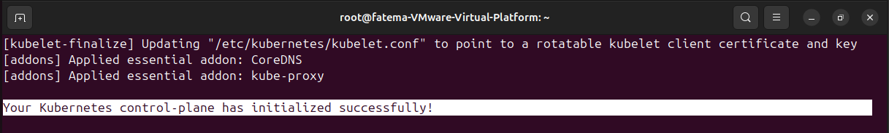
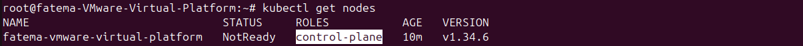
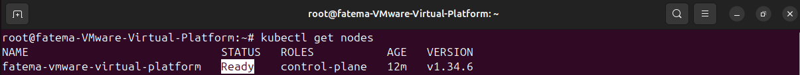
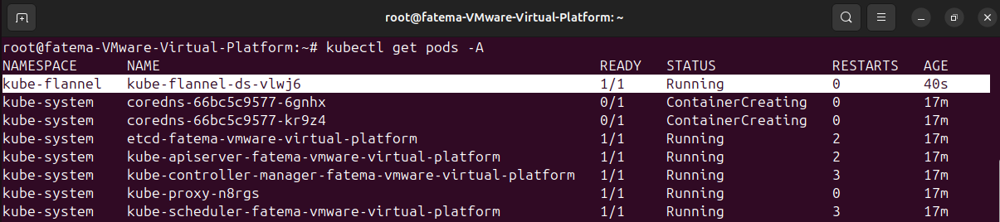
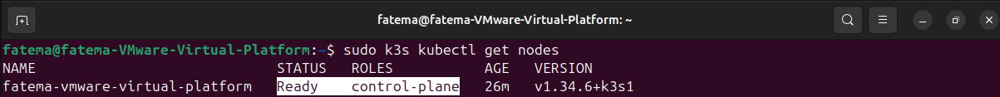
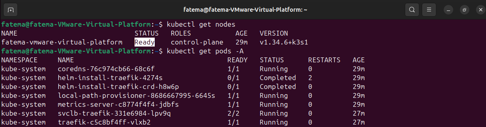

# LAB #1

### Step 1: Installing kubernetes

- Create 2 virtual machines
- On the first server install kubernetes ```v1.34.6``` using kubeadm
- The first server should be the controlplane server

Follow This Repo ```https://gist.github.com/galal-hussein/96ac1b9094198094dfea0a04f145c009```





- Run the pod networking CNI (flannel)

```bash
kubectl apply -f https://github.com/flannel-io/flannel/releases/latest/download/kube-flannel.yml
```




- Join the second server as a worker node using kubeadm
 
Follow This Repo ```https://gist.github.com/galal-hussein/96ac1b9094198094dfea0a04f145c009```, 
Except the last 2 steps Kubeadm installing
 
then Run the join command you got from the master:

```bash
kubeadm join 172.16.62.129:6443 --token erowi7.ttm6qzm6b0zerm3t \
	--discovery-token-ca-cert-hash sha256:c58a5551595e5907671ffae81fbf1a05501256aa74f02fed2a2c44be7a81cd1b
```

---

### Note:
### My Laptop Can't Stand with this 2 Ubuntu VMs
### MY Laptop is Crashing Everytime because my Hard is HDD and 8 GRAMs

---

### Step 2: Using kubectl run the following deployment on the cluster

```bash
nano nginx-deployment.yaml
```

write this inside the yaml file:

```
apiVersion: apps/v1
kind: Deployment
metadata:
  name: nginx-deployment
  labels:
    app: nginx
spec:
  replicas: 3
  selector:
    matchLabels:
      app: nginx
  template:
    metadata:
      labels:
        app: nginx
    spec:
      containers:
      - name: nginx
        image: nginx:1.14.2
        ports:
        - containerPort: 80
```

save and run:

```bash
kubectl apply -f nginx-deployment.yaml
```

---

### Bonus: using k3s redo the whole lab to install one server and one agent node and make sure that nodes are up and running

on the server:

```bash
curl -sfL https://get.k3s.io | sh -
```



```bash
mkdir -p ~/.kube
sudo cp /etc/rancher/k3s/k3s.yaml ~/.kube/config
sudo chown $(whoami):$(whoami) ~/.kube/config

export KUBECONFIG=$HOME/.kube/config
```


get Token from Master:

```bash
sudo cat /var/lib/rancher/k3s/server/node-token
```

Token: ```K109a9fb1c72ab65fbc281934945f6dae6989f47fc02241900ab1f6d3c8aced245d::server:9ea9d24b6b835b725ccd7742d81c5eaf```

if i want to add another machine as a worker:

```bash
curl -sfL https://get.k3s.io | K3S_URL=https://172.16.62.125:6443 K3S_TOKEN=K109a9fb1c72ab65fbc281934945f6dae6989f47fc02241900ab1f6d3c8aced245d::server:9ea9d24b6b835b725ccd7742d81c5eaf sh -
```