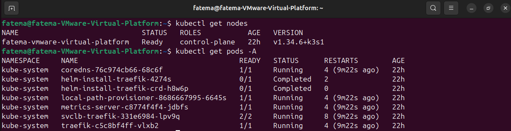
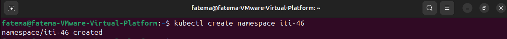
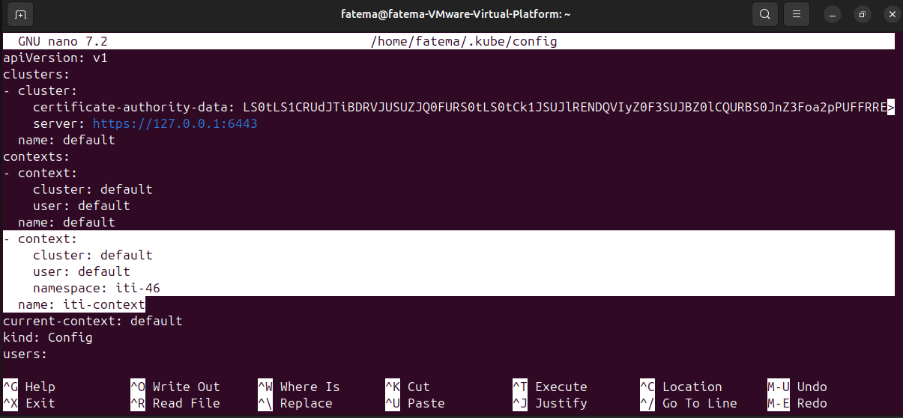
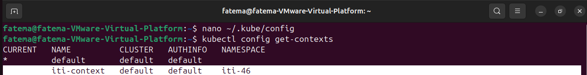
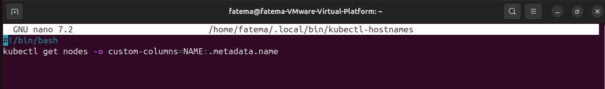
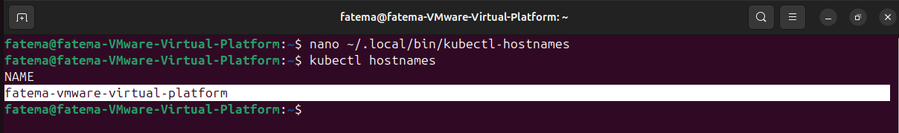
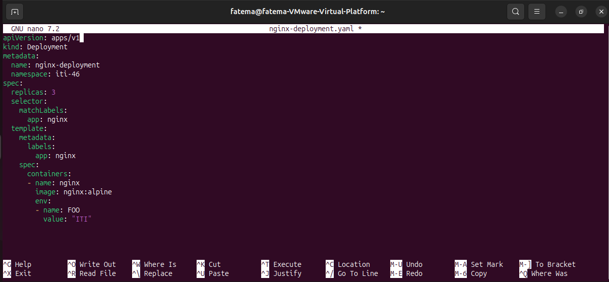
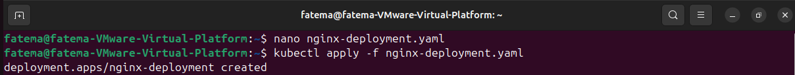
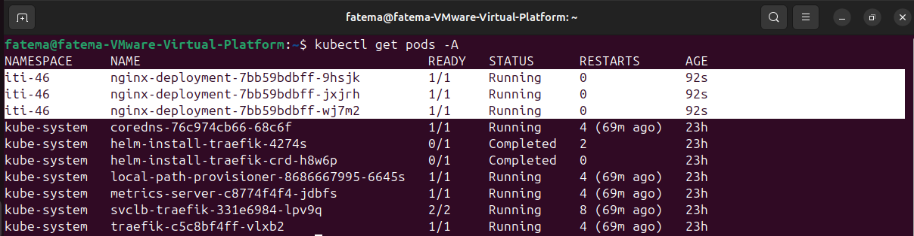

# LAB #2

### Step 1: Kubectl config:

- Create a k3s cluster with 1 server (controlplane) and 1 agent (worker)


- In your cluster create a new namespace called ```iti-46```.

```bash
kubectl create namespace iti-46
```


- Edit the kubectl config file to add a new context ```iti-context``` that uses the default user with the new namespace you just created.

```bash
nano ~/.kube/config
```

add This in Context:

```
- context:
    cluster: default
    user: default
    namespace: iti-46
  name: iti-context
```

```bash
kubectl config get-contexts
```




### Step 2: Kubectl plugin:

- Create a new kubectl plugin called ```kubectl hostnames``` that should display the hostnames of all your nodes on the cluster.

```bash
mkdir -p ~/.local/bin
touch ~/.local/bin/kubectl-hostnames
nano ~/.local/bin/kubectl-hostnames
```

write this code script:
```
#!/bin/bash
kubectl get nodes -o custom-columns=NAME:.metadata.name
```

save and run:

```bash
chmod +x ~/.local/bin/kubectl-hostnames
export PATH=$PATH:~/.local/bin
kubectl hostnames
```




### Step 2: Creating deployments:

- Create a deployment YAML file that has 3 replicas of image ```nginx:alpine```.
- The pods inside the deployments must have env ```FOO=ITI```.

```bash
nano nginx-deployment.yaml
```

add This in the YAML file:

```
apiVersion: apps/v1
kind: Deployment
metadata:
  name: nginx-deployment
  namespace: iti-46
spec:
  replicas: 3
  selector:
    matchLabels:
      app: nginx
  template:
    metadata:
      labels:
        app: nginx
    spec:
      containers:
      - name: nginx
        image: nginx:alpine
        env:
        - name: FOO
          value: "ITI"xt
```



```bash
kubectl apply -f nginx-deployment.yaml
```



```bash
kubectl get pods -A
```

