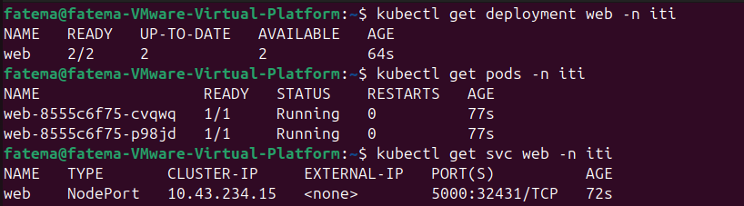
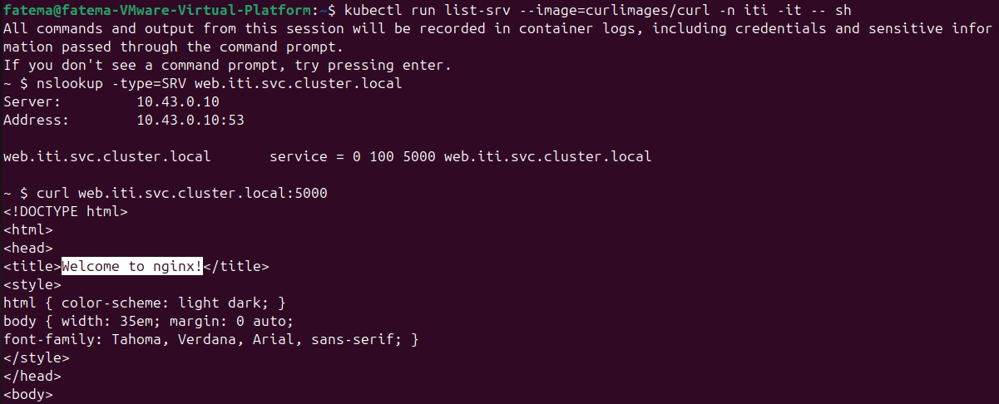
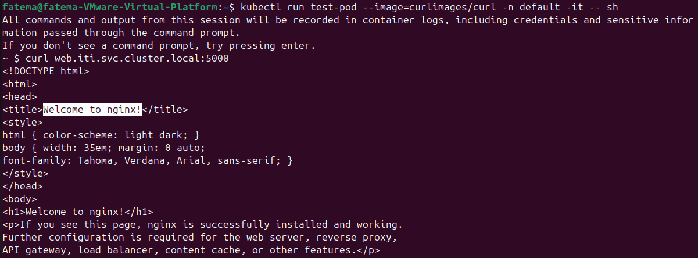
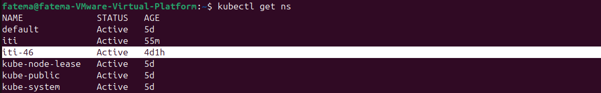
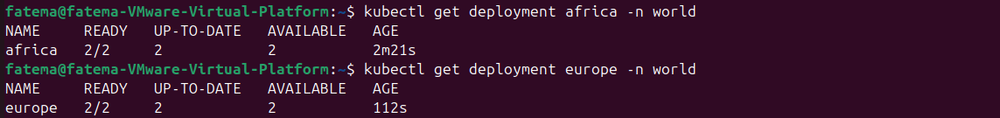
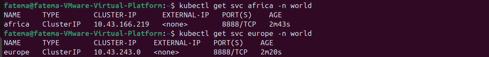
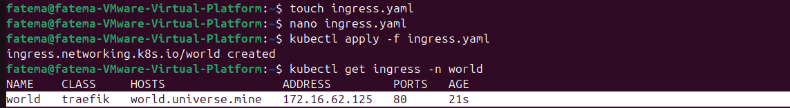
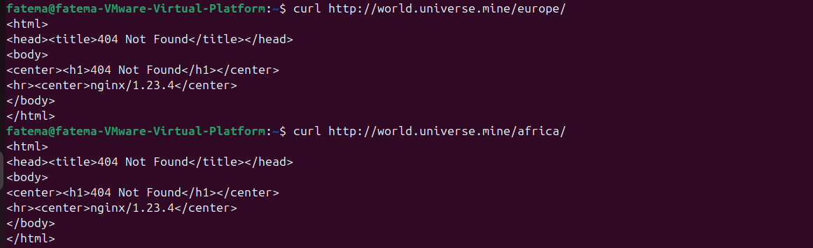

# LAB #3

### Step 1: DNS:

- Create a deployment on ```iti``` namespace thats called web, which has 2 replicas.
- The application should run application on port ```80``` it can be any webserver.
- Create a NodePort service that serves as a load balancer for this deployment, the service should has the port ```5000```.

```bash
kubectl create namespace iti
kubectl create deployment web --image=nginx --replicas=2 --port=80  -n iti --dry-run=client -o yaml > web.yaml
kubectl apply -f web.yaml
kubectl expose deployment web --type=NodePort --port=5000 --target-port=80 -n iti --dry-run=client -o yaml > service.yaml
```



- List the SRV record of the service and make sure it resolves to the domain of the service.

```bash
kubectl run list-srv --image=curlimages/curl -n iti -it -- sh
~ $ nslookup -type=SRV web.iti.svc.cluster.local
~ $ curl web.iti.svc.cluster.local:5000
```



- Create another test pod on a default namespace with the image that contain curl command, make sure to exec to the pod and reach the service created for the web application with its domain name

```bash
kubectl run test-pod --image=curlimages/curl -n default -it -- sh
~ $ curl web.iti.svc.cluster.local:5000
```



### Step 2: Ingress and services:

- Create namespace called ```iti-46```

```bash
kubectl create namespace iti-46
```



- Create 2 deployments in world namespace:
    1. africa with 2 replicas and image ```husseingalal/africa:latest```
    2. europe with 2 replicas and image ```husseingalal/europe:latest```

```bash
kubectl create namespace world
kubectl create deployment africa --image=husseingalal/africa:latest --replicas=2 -n world
kubectl create deployment europe --image=husseingalal/europe:latest --replicas=2 -n world
```



- Using kubectl expose create ClusterIP Services for both Deployments for port ```8888``` and target port ```80```, The Services should have the same name as the Deployments.

```bash
kubectl expose deployment africa --port=8888 --target-port=80 --type=ClusterIP -n world
kubectl expose deployment europe --port=8888 --target-port=80 --type=ClusterIP -n world
```



- Create a new Ingress resource called world for domain name world.universe.mine, The domain points to the K8s Node IP via /etc/hosts . The Ingress resource should have two routes pointing to the existing Services: ```http://world.universe.mine/europe/``` and ```http://world.universe.mine/africa/```

```bash
touch ingress.yaml
nano ingress.yaml
```

Write This:
```
apiVersion: networking.k8s.io/v1
kind: Ingress
metadata:
  name: world
  namespace: world
spec:
  rules:
  - host: world.universe.mine
    http:
      paths:
      - path: /africa
        pathType: Prefix
        backend:
          service:
            name: africa
            port:
              number: 8888
      - path: /europe
        pathType: Prefix
        backend:
          service:
            name: europe
            port:
              number: 8888

```

```bash
kubectl apply -f ingress.yaml
kubectl get ingress -n world
```



Add the ```172.16.62.125 world.universe.mine``` to the hosts file:

```bash
sudo nano /etc/hosts
```

