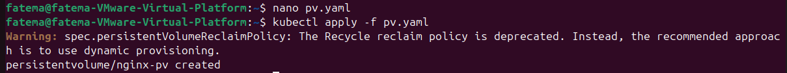
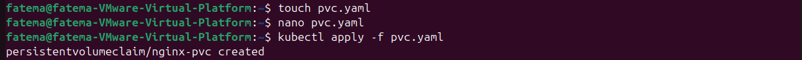
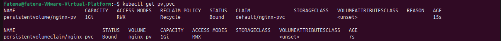
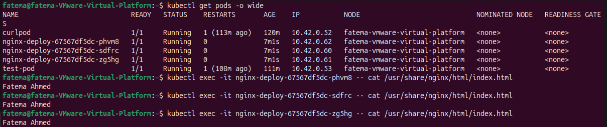
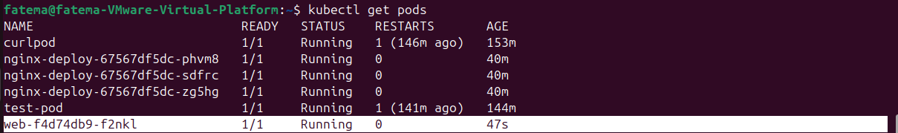
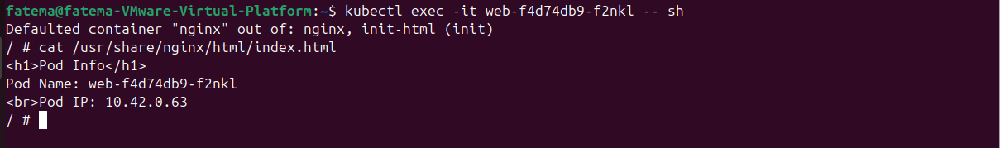
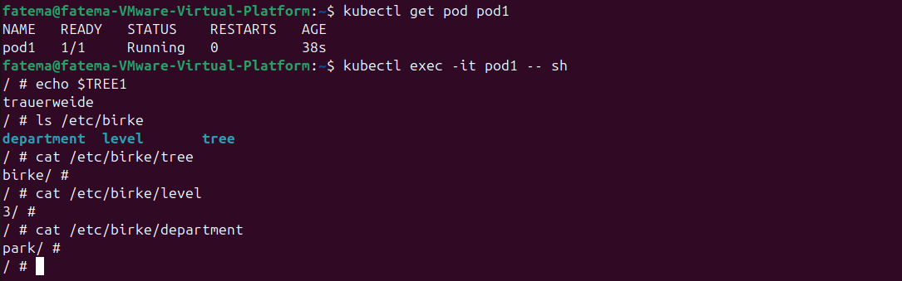

# LAB #4

### Step 1: Persistent Volumes:

- Create PV called ```nginx-pv```, using hostPath type, with storage capacity 1 GB
- Create a pvclaim to use the ```nginx-pv```, make sure that the claim and the pv can be used multiple times with recycle retain policy

```bash
touch pv.yaml
nano pv.yaml
```

Write This:
```
apiVersion: v1
kind: PersistentVolume
metadata:
  name: nginx-pv
spec:
  capacity:
    storage: 1Gi
  accessModes:
    - ReadWriteMany
  persistentVolumeReclaimPolicy: Recycle
  storageClassName: ""
  hostPath:
    path: /data/nginx
```

```bash
kubectl apply -f pv.yaml
```



```bash
touch pvc.yaml
nano pvc.yaml
```

Write This:
```
apiVersion: v1
kind: PersistentVolumeClaim
metadata:
  name: nginx-pvc
spec:
  accessModes:
    - ReadWriteMany
  resources:
    requests:
      storage: 1Gi
  volumeName: nginx-pv
  storageClassName: ""
```

```bash
kubectl apply -f pvc.yaml
```



Check Bounding:


- The hostPath on the host must contain ```index.html``` file that contains your full name

```bash
sudo mkdir -p /data/nginx
echo "Fatema Ahmed" | sudo tee /data/nginx/index.html
```

- Mount this pvclaim inside a deployment of 3 replicas and make sure they run on the same node

Create the Deployment File

```bash
kubectl create deployment nginx-deploy --image=nginx:alpine --replicas=3 --dry-run=client -o yaml > deployment.yaml
```

Edit the ```deployment.yaml``` file:
```
apiVersion: apps/v1
kind: Deployment
metadata:
  name: nginx-deploy
  labels:
    app: nginx-deploy
spec:
  replicas: 3
  selector:
    matchLabels:
      app: nginx-deploy
  template:
    metadata:
      labels:
        app: nginx-deploy
    spec:
      nodeName: fatema-vmware-virtual-platform

      containers:
      - name: nginx
        image: nginx:alpine
        volumeMounts:
        - name: nginx-storage
          mountPath: /usr/share/nginx/html

      volumes:
      - name: nginx-storage
        persistentVolumeClaim:
          claimName: nginx-pvc
```

Then Apply it:

```bash
kubectl apply -f deployment.yaml
```

Test mounted content:



### Step 2: downward api:

- Create a downward pv that uses the podIP and podName
- Create a claim that uses this pv
- Create a deployment that mounts this PVclaim and make sure that the podIP and podName are displayed in the ```index.html``` file

```bash
nano pv.yaml
```

Edit the file:
```
apiVersion: v1

kind: PersistentVolume
metadata:
  name: web-pv
spec:
  capacity:
    storage: 1Gi
  accessModes:
    - ReadWriteOnce
  persistentVolumeReclaimPolicy: Retain 
  storageClassName: ""
  hostPath:
    path: /tmp/webdata
```
Apply the File:

```bash
kubectl apply -f pv.yaml
```

```bash
nano pvc.yaml
```

Edit the file:
```
apiVersion: v1
kind: PersistentVolumeClaim
metadata:
  name: web-pvc
spec:
  accessModes:
    - ReadWriteOnce
  resources:
    requests:
      storage: 1Gi
  storageClassName: ""
```

Apply the File:

```bash
kubectl apply -f pvc.yaml
```

Create the Deployment YAML file:

```bash
nano deployment.yaml
```

Edit the file:
```
apiVersion: apps/v1
kind: Deployment
metadata:
  name: web
spec:
  replicas: 1
  selector:
    matchLabels:
      app: web
  template:
    metadata:
      labels:
        app: web
    spec:

      volumes:
        - name: html-volume
          persistentVolumeClaim:
            claimName: web-pvc

        - name: podinfo
          downwardAPI:
            items:
              - path: "podName"
                fieldRef:
                  fieldPath: metadata.name

      initContainers:
        - name: init-html
          image: busybox
          command: ["/bin/sh", "-c"]
          env:
            - name: POD_IP
              valueFrom:
                fieldRef:
                  fieldPath: status.podIP
          args:
            - |
              echo "<h1>Pod Info</h1>" > /html/index.html
              echo "Pod Name: $(cat /podinfo/podName)" >> /html/index.html
              echo "<br>Pod IP: $POD_IP" >> /html/index.html

          volumeMounts:
            - name: html-volume
              mountPath: /html
            - name: podinfo
              mountPath: /podinfo

      containers:
        - name: nginx
          image: nginx:alpine
          ports:
            - containerPort: 80
          volumeMounts:
            - name: html-volume
              mountPath: /usr/share/nginx/html
```

Apply it:
```
kubectl apply -f deployment.yaml
```




### Step 3: ConfigMaps:

- Create a file on your system on ```/opt/cm.yaml``` with content:
```
apiVersion: v1
data:
  tree: birke
  level: "3"
  department: park
kind: ConfigMap
metadata:
  name: birke
```

```bash
sudo touch /opt/configMap.yaml
sudo nano /opt/configMap.yaml
```

Edit the File with the given content.

Then Apply it:

```bash
kubectl apply -f /opt/configMap.yaml
```

- Create a ConfigMap named trauerweide with content ```tree=trauerweide```

```bash
kubectl create configmap trauerweide --from-literal=tree=trauerweide
```

- Create a Pod named ```pod1``` of image ```nginx:alpine``` and make key tree of ConfigMap trauerweide available as environment variable ```TREE1``` also Mount all keys of ConfigMap birke as volume. The files should be available under ```/etc/birke/*```

```bash
touch pod1.yaml
nano pod1.yaml
```

Write this:
```
apiVersion: v1
kind: Pod
metadata:
  name: pod1
spec:
  containers:
  - name: nginx
    image: nginx:alpine

    env:
    - name: TREE1
      valueFrom:
        configMapKeyRef:
          name: trauerweide
          key: tree

    volumeMounts:
    - name: birke-volume
      mountPath: /etc/birke

  volumes:
  - name: birke-volume
    configMap:
      name: birke
```

then Apply the file:

```bash
kubectl apply -f pod1.yaml
```


